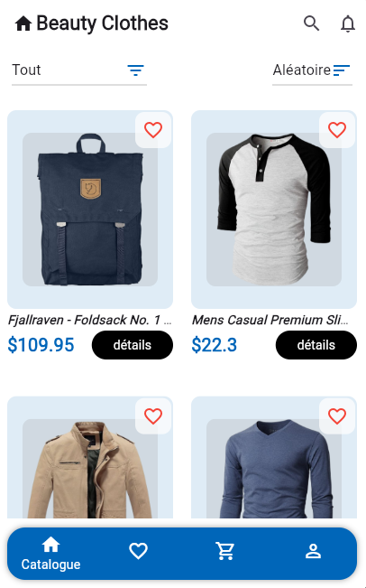
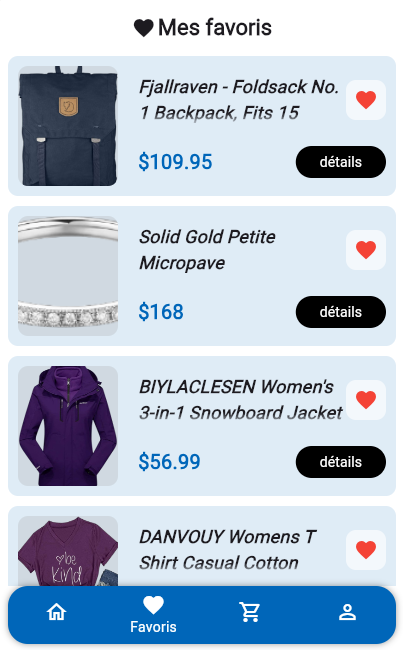
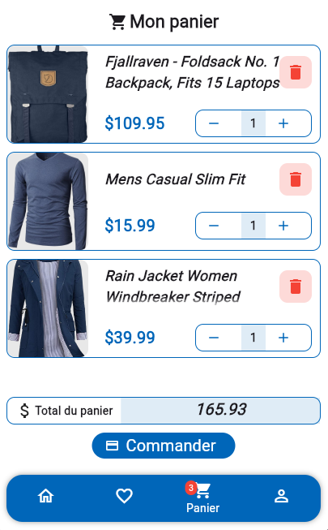
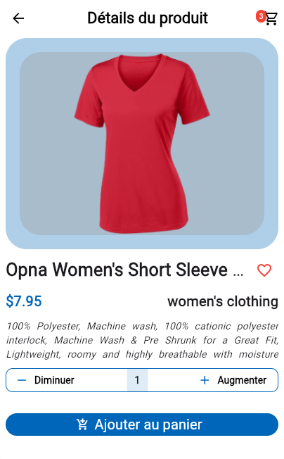

# beauty_clothes
 Une application E-Commerce multiplateforme

## Execution des tests
- Placez vous a la racine du projet
- Taper la commande suivante 
```bash
flutter test -r expanded
```

## Les dépendances utilisées
- ***go_router*** : pour la gestion de la navigation et du routing
- ***flutter_riverpod*** : pour le State Management
- ***faker*** : pour la generation des fausses données dans la phase de mocking
- ***http*** : pour la reception des donnees json provennt de la fausse Api utilisée pour le projet
- ***shared_preferences*** : pour la persistance locale des données sur toutes les platformes

## Fonctionnalités implémentées
- Listing des produits
- Filtre des produits selon les catégories
- Tri des produits par aordre alphabetique croissante et décroissante
- Definir ou supprimer un produit comme favori
- Avoir plus de details sur un produit
- Ajouter un produit au panier pour une commnde ulterieure
- persistance locale des donnes de l'application
- le mock du profil

## Captures d'ecran de l'app

### Catalogue + Filtre + Tri
<p align="center">
    
</p>

### Favoris
<p align="center">
    
</p>

### Panier
<p align="center">
    
</p>

### Profil
<p align="center">
    
</p>

### Details
<p align="center">
    
</p>